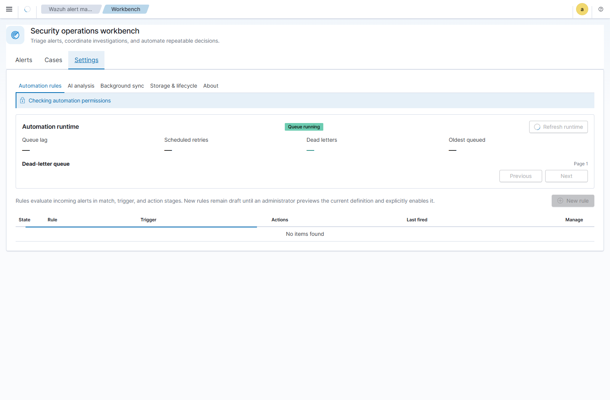
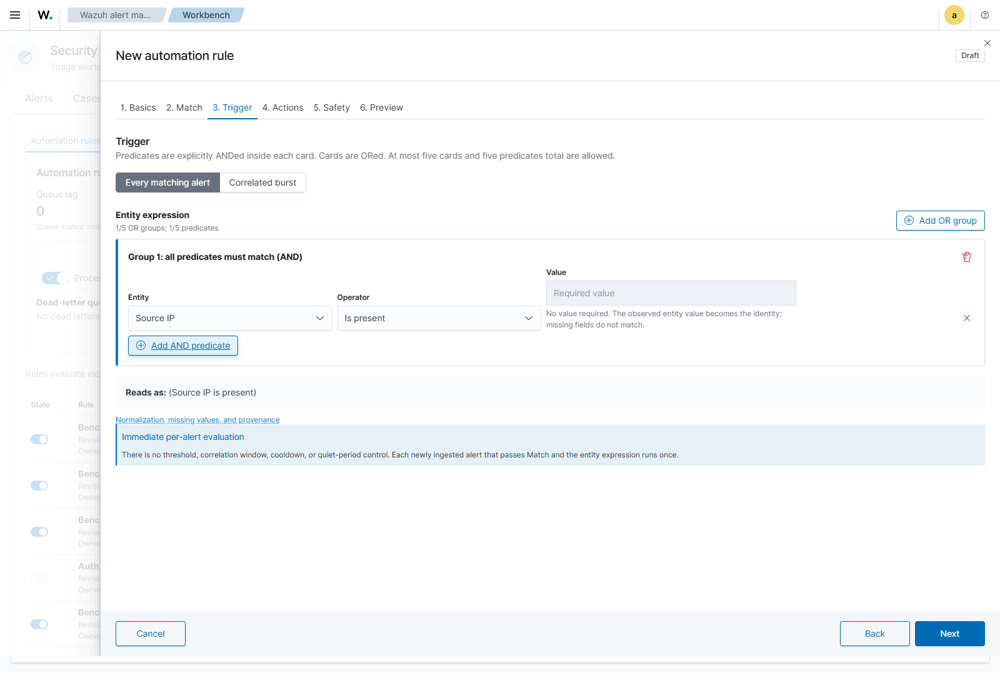

# Automation Rules

Automation rules act on alerts when they are first ingested into the Workbench operational store. Manage them under **Workbench -> Settings -> Automation rules**.



Rules are evaluated in this order:

1. **Match** selects the Wazuh alerts in scope.
2. **Trigger** applies entity predicates and decides when to fire.
3. **Actions** update Workbench status, assignment, or a deduplicated case.

Rule editing, preview, activation, rollback, deletion, queue settings, and dead-letter mutations require the effective Wazuh/OpenSearch Security `all_access` role. The UI is read-only otherwise. SSO, LDAP, or organizational-unit names are not authorization inputs by themselves; configure the mapped Wazuh user roles as described in the [Wazuh user administration documentation](https://documentation.wazuh.com/current/user-manual/user-administration/index.html).

## Match Scope

All populated Match fields are combined with **AND**. Agent/host scope belongs here and is not repeated as a separate trigger filter.

| Condition | Meaning |
|-----------|---------|
| Rule groups | Wazuh rule groups, such as `authentication_failed` or `pam`. |
| Rule IDs | Specific Wazuh rule IDs, such as `5710` or `5716`. |
| Agents | The agents/hosts in scope. |
| Minimum level | The minimum Wazuh rule level. |

Within Rule groups, Rule IDs, and Agents, **Any of** accepts any listed value. For burst rules, **All of** requires every listed value to occur for the same resolved correlation key within the window. Per-alert rules use **Any of** because one immediate alert has no cross-alert co-occurrence window.

A match definition with no restrictions matches every alert and requires an explicit safety acknowledgment. Changing Match clears that acknowledgment.

## Trigger Entity Expression



The Trigger page supports a constrained expression with no free-form query syntax:

- predicates inside a group are joined with **AND**;
- groups are joined with **OR**;
- a rule may contain at most five groups and five predicates in total;
- each predicate uses an entity, `Equals` or `Is present`, and a value when required;
- duplicate predicates and blank or invalid values are rejected before save.

Example:

```text
(Source IP equals 10.20.30.40 AND Destination port equals 22)
OR
(Source user equals administrator AND Process equals sshd)
```

Supported entities are Agent, Source/Destination IP, Source/Destination port, Source/Destination user, and Process. Agent can be part of a correlation identity, but agent scope still belongs on Match.

Preview and live execution use the same normalization and expression evaluator. IP addresses are canonicalized, ports are validated as integers from 0 through 65535, and user/process values are lowercased. A missing field does not form an `unknown` bucket; that group does not match. If one alert satisfies multiple OR groups, actions run once and all matching-group provenance is retained.

The operator/value behavior is deliberately explicit:

| Definition | Result |
|------------|--------|
| `Equals` with a valid value | Matches only that normalized value. |
| `Equals` with a blank or invalid value | Rejected; the rule cannot be saved or enabled. A blank value never becomes a wildcard. |
| `Is present` | Requires the field but no configured value. The actual value observed on the alert becomes the correlation and case-deduplication identity. |
| No entity groups | Every alert that passes Match qualifies. With one-case-per-rule routing, matching alerts share the active rule case. |

For example, `Source IP is present` does not put all source addresses into an
anonymous bucket. With **Separate by entity group**, `10.0.0.5` and `10.0.0.8`
have different identities and therefore different active cases. For a compound
group such as `Source IP is present AND Destination port is present`, the
identity is the normalized tuple, for example `10.0.0.5 + 22`.

## Trigger Modes

### Every Matching Alert

Each newly ingested alert that passes Match and the entity expression fires immediately. There is no threshold, correlation window, cooldown, or quiet-period setting.

All shipped actions are available, including **Create or update a deduplicated case**. The case identity is based on the rule and normalized matched entity-group values. A later alert with the same identity extends the active case rather than creating a duplicate. Closed or archived cases are not silently reopened; a later match creates a new case.

Consequently, an immediate rule using `Source IP is present` and **Separate by
entity group** maintains one active case per source IP. Each later qualifying
alert for that address is linked to the active case. Closing the case completes
that incident; the next qualifying alert creates a new deterministic case
generation for the same address.

### Correlated Burst

Threshold and sliding window are shared settings, but apply independently to each resolved OR group/key. Each group maintains independent counters, cooldown, rearm state, and provenance. An alert contributing to multiple groups does not receive the same non-case action twice.

Cooldown suppresses repeated firings for the same key. Rearm requires the configured quiet period, preventing a sustained burst from firing repeatedly. An existing active deduplicated case may continue to receive matching evidence according to the runtime policy.

For `Source IP is present`, a threshold of five means five qualifying alerts for
the **same** normalized source IP inside the sliding window—not five alerts with
five arbitrary addresses. When the threshold fires, all qualifying alerts in
that IP's burst window are linked to its case. A later eligible burst for the
same IP extends that active case with new evidence; after the case is closed, a
later burst starts a new case generation. Cooldown, rearm, evidence ownership,
and configured safety caps still govern what can be processed in each run.

When case creation is enabled, routing controls the deduplication scope:

| Routing | Behavior |
|---------|----------|
| **Separate by entity group** | Default and recommended. Keeps one active case per rule, group, and normalized entity tuple. |
| **Consolidate overlapping bursts** | Combines groups only when their triggering alert sets overlap in the same correlation window. |
| **One active case per rule** | Advanced. All bursts update one rule case and may mix unrelated activity or create a very large case. |

Every routing mode is deterministic and replay-safe. Repeated durable execution cannot duplicate an action or case, and case history records the contributing correlation provenance.

## Actions and Safety

Choose at least one action:

| Action | Effect |
|--------|--------|
| Set status | Sets matching Workbench alerts to Open, In progress, or Closed. |
| Assign to | Assigns matching alerts and a created case to an analyst. |
| Create or update a deduplicated case | Creates a case or extends the active case for the effective deduplication scope. |

Status and assignment preconditions can limit changes to expected workflow state. Rule priority and sort order determine evaluation order; **Stop processing** prevents lower-priority rules from acting after this rule. Per-run action/case caps and an execution rate limit bound impact. Conflicts and cap/rate skips are visible in preview and runtime counters.

## Preview and Activation

New rules are always saved as disabled drafts. Activation is an explicit workflow:

1. Save the disabled draft.
2. Preview that exact saved revision over the historical 24-hour interval.
3. Review totals, truncation, missing entities, conflicts, skips, rate caps, representative alerts, and case-routing effects.
4. Select **Enable after save**, then save.

Preview is historical and read-only. It uses the same normalized planner, sliding-window evaluation, preconditions, deduplication, routing, conflict behavior, and safety caps as live execution. It never changes historical alerts or cases and never enqueues replay work. Editing a previewed definition makes the approval stale; save and preview the new exact revision again.

Rollback creates a new revision from an earlier snapshot and preserves revision history. The restored definition must be reviewed and previewed before activation.

## Forward-Only Semantics

Creating, editing, or enabling a rule does not scan or mutate alerts already ingested by the plugin. There is no replay or backfill control.

A genuinely new late-arriving Wazuh alert is evaluated even when its event timestamp is old because it is new to plugin ingestion. Durable queue work that completes after pause, outage, or restart is delayed completion of the original ingestion-time event, not retroactive evaluation. It uses the ruleset snapshot and rule revisions captured when the event was admitted.

## Worked examples

### Immediate SSH case with deduplication

```text
Match
  Rule group: authentication_failed
  Minimum level: 5

Trigger: Every matching alert
  Source IP equals 10.20.30.40
  AND Destination port equals 22

Actions
  Set status: In progress
  Create/update case: High
```

The first newly ingested matching alert creates one case. A second matching
alert an hour later extends that case while it is Open or In progress. It does
not create one case per alert. If the earlier case is Closed or archived, the
new alert creates a new active case; automation never silently reopens finished
work.

### One burst rule for two independent entity groups

```text
Match
  Rule IDs: 5710, 5716 (Any of)

Trigger: Correlated burst
  (Source IP equals 203.0.113.88)
  OR
  (Source IP equals 203.0.113.89)
  Threshold: 5
  Window: 10 minutes
  Routing: Separate by entity group
```

Five `.88` alerts create/update the `.88` case. Five `.89` alerts create/update
a separate `.89` case. Counters, cooldown, rearm, and provenance are independent
for the two groups, so unrelated attackers are not merged merely because they
matched one rule.

### Boolean identity with overlapping consolidation

```text
(Source IP equals 10.20.30.40 AND Destination port equals 22)
OR
(Source user equals administrator AND Process equals sshd)
```

With **Separate by entity group**, each branch has its own case identity. With
**Consolidate overlapping bursts**, branches consolidate only when their firing
alert sets overlap inside the same window. **One active case per rule** ignores
that separation and should be reserved for intentionally broad campaigns.

### Choosing values safely

- Put host/agent scope on Match; do not repeat it merely because Agent is also
  available as a correlation entity.
- Use `Is present` when existence matters regardless of value.
- Remember that `Is present` still separates identities by each observed value;
  it is not a single wildcard bucket under Separate by entity group.
- Prefer Separate by entity group unless analysts explicitly want campaign-wide
  consolidation.
- Start with conservative action/case caps and inspect preview conflicts and
  missing-entity counts before activation.
- Preview answers “what would this definition have done?” It never makes the
  rule retroactive.

## Queue and Dead Letters

The runtime panel distinguishes two independent states:

- disabling a rule prevents that rule from receiving newly admitted work;
- pausing automation stops queue processing while preserving enabled rule definitions and durable queued events.

Administrators can pause/resume processing and set active-backlog and deferred-event caps. Queue admission closes when those bounds are reached. The dead-letter list is cursor-paginated. **Retry** safely returns a recoverable event to the durable queue using its captured ruleset snapshot; **Resolve** removes a dead letter without replaying it. Both operations are idempotent and require `all_access`.

See [[Troubleshooting]] for queue and rule diagnostics and [[Security Model]] for authorization and blast-radius controls.

## Operational checklist

1. Confirm Background sync is current and its DLQ is understood.
2. Save the rule as a disabled draft.
3. Preview the exact saved revision and examine truncation, conflicts, and caps.
4. Activate it during a monitored change window.
5. Watch queue lag, retries, DLQ, cases created, and rule counters.
6. Pause processing—not rule definitions—if queued work must be preserved while
   investigating an operational problem.
7. Disable the rule to stop admission of new work for that rule.
