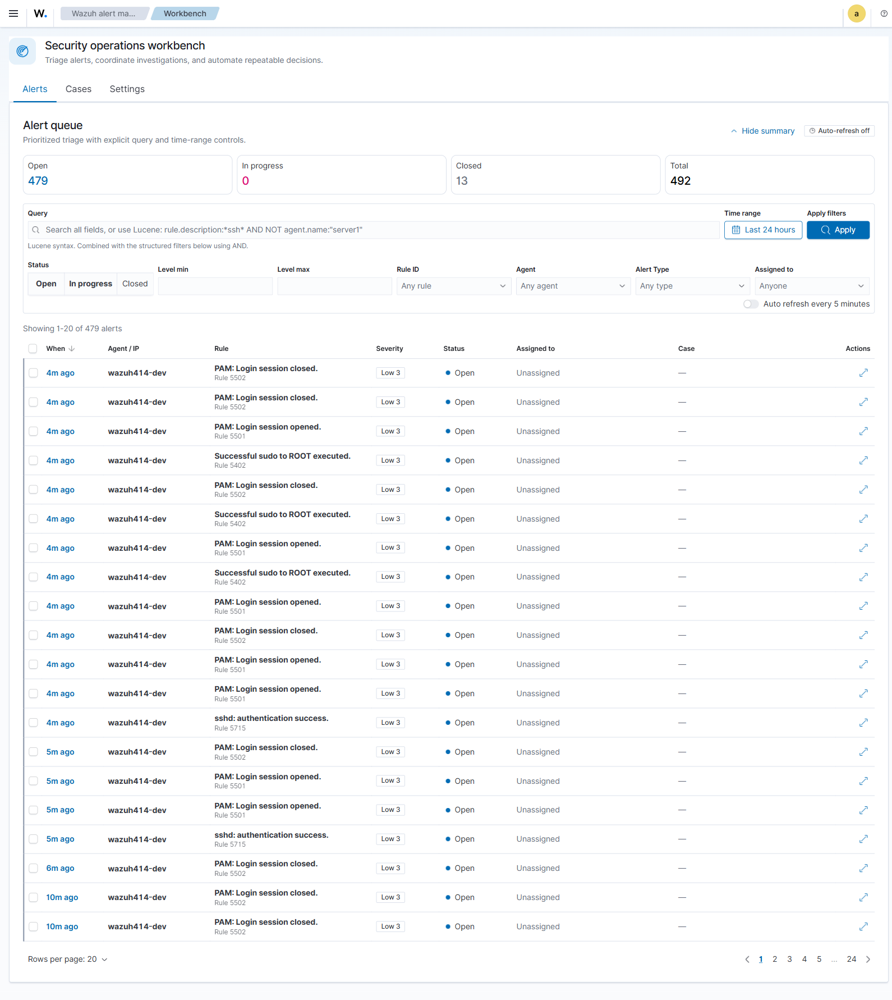

# Wazuh Alert Manager

**Wazuh Alert Manager** is an (unofficial) OpenSearch Dashboards plugin that turns Wazuh alerts into a working SOC workbench: triage alerts with a real lifecycle, group them into investigative cases, automate the routine handling, and report on what your team is doing.

> ⚠️ **Unofficial** — this plugin is not produced or endorsed by Wazuh Inc. It reads Wazuh's alerts and stores its own workflow state in separate indices; it never modifies `wazuh-alerts-*`.

## What it gives you

- **Alert lifecycle** — every alert carries an **Open → In progress → Closed** status, an assignee, and an audit history, stored independently of the raw Wazuh alert.
- **Cases** — bundle related alerts into an investigation with severity, status, comments, an **attack-path graph**, and MITRE **kill-chain** view.
- **Automation rules** — match alerts and, on a per-alert or burst trigger, **open a case**, **auto-close** routine noise, and/or **auto-assign** to an analyst. See [[Automation Rules]].
- **Triage helpers** — a **"seen before"** precedent callout and **suggested related alerts**, both deterministic (no LLM).
- **Reporting** — status donuts, status-over-time, period-over-period deltas, SLA compliance, and per-analyst workload/performance. See [[Reporting]].
- **Optional AI analysis** — bring-your-own-key summaries with a strict egress boundary. See [[AI Analysis]] and [[Security Model]].

## Supported versions

| Wazuh | OpenSearch Dashboards | Plugin build |
|-------|-----------------------|--------------|
| 4.12  | 2.19.1                | `wazuhAlertManager-2.19.1.zip` |
| 4.13  | 2.19.2                | `wazuhAlertManager-2.19.2.zip` |
| 4.14  | 2.19.5                | `wazuhAlertManager-2.19.5.zip` |

Download the zip for your version from the **[Releases page](https://github.com/SamsonIdowu/Wazuh-alert-manager/releases)**. The server code is identical across builds; only the target-version stamp differs.

## Where to next

- **[[Installation]]** — install/upgrade the plugin.
- **[[User Guide]]** — the Workbench (Alerts, Cases, Settings) and Reporting.
- **[[Automation Rules]]** — the rule engine in depth.
- **[[Lifecycle, Retention and RBAC|Lifecycle-Retention-and-RBAC]]** — rollover, retirement, restore, retention, and administrator permissions.
- **[[Case Evidence and Case Lifecycle|Case-Evidence-and-Case-Lifecycle]]** — what remains live, what is archived, and how a case is reopened safely.
- **[[Security Model]]** — identity, data egress, and what leaves the network.
- **[[Troubleshooting]]** — common issues (including the indexer startup timeout).
- **[[Architecture]]** — how the sync job and indices work.
- **[[Release Notes 2.0|Release-Notes-2.0]]** — v2.0 features, compatibility, and validation scope.
