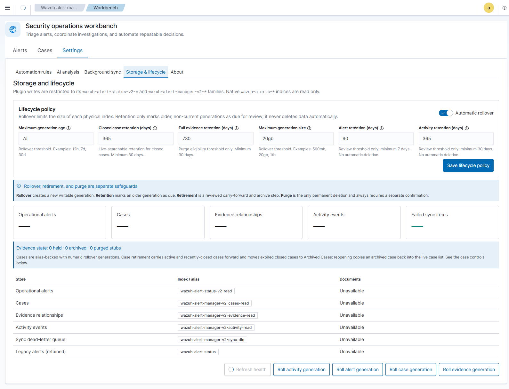

# Lifecycle, retention, and Wazuh RBAC

Wazuh Alert Manager uses the identity and effective roles already established by the Wazuh indexer Security plugin. It does not maintain a second user database, accept client-supplied identity headers, or require a plugin-specific role during installation.

## Authorization matrix

| Operation | Required effective OpenSearch Security role |
| --- | --- |
| View Workbench storage health, lifecycle policy, migration status, and generation state | Any user who can use the plugin |
| Save rollover and retention settings | `all_access` or `index_management_full_access` |
| Manually roll an alert, activity, case, or evidence generation | `all_access` or `index_management_full_access` |
| Carry unresolved alerts forward and retire a generation | `all_access` or `index_management_full_access` |
| Restore missing alerts from a retained generation | `all_access` or `index_management_full_access`, plus explicit confirmation |
| Retire an append-only activity generation | `all_access` or `index_management_full_access` |
| Permanently purge a validated, retained generation | `all_access` or `index_management_full_access`, plus explicit confirmation |
| Configure AI credentials or create/update/delete automation rules | `all_access` |

All checks are repeated in the server route. Disabling or hiding a Workbench control is only a usability aid and is not the security boundary.

`index_management_full_access` is an existing OpenSearch Security role for delegated index-management operations. `all_access` is the existing cluster administrator role. The plugin reads the effective `roles` collection returned by the authenticated Security-plugin account endpoint. It does not authorize a user merely because an untrusted or unmapped backend group happens to be named `admin`.

## Internal users

Follow the Wazuh procedure for creating an internal user and mapping it to an indexer role and a Wazuh role. A normal Wazuh administrator mapped to `all_access` automatically receives plugin lifecycle administration. A storage operator can instead be mapped to the existing `index_management_full_access` role to receive lifecycle controls without receiving the plugin's broader administrator operations.

Wazuh documentation: [Wazuh RBAC—create and map internal users](https://documentation.wazuh.com/current/user-manual/user-administration/rbac.html)

## SSO

Wazuh SAML configurations use `roles_key` to receive IdP groups/roles as backend roles. Map the administrator or storage-operator group to `all_access` or `index_management_full_access` in the Wazuh indexer. The resulting effective role is what the plugin evaluates, so no plugin configuration changes are required when the IdP, group name, or organizational structure changes.

Wazuh documentation: [Single Sign-On](https://documentation.wazuh.com/current/user-manual/user-administration/single-sign-on/index.html)

## Active Directory and LDAP

Wazuh's LDAP/AD integration obtains group membership from the configured group OU and exposes those groups as backend roles. Map the appropriate group—for example, the organization's existing Wazuh administrators or index-management operators—to an effective role listed in the matrix. Users in read-only groups see lifecycle state but cannot mutate it.

Wazuh documentation: [Active Directory and LDAP integration](https://documentation.wazuh.com/current/user-manual/user-administration/ldap.html)

## Retention safety model

### What each setting means

| Setting | Meaning | Example |
|---|---|---|
| Automatic rollover | Checks plugin-owned generation families and rolls a writer when either configured limit is reached. It does not retire or delete the old generation. | Enabled |
| Maximum generation age | Oldest allowed age of the current write generation before rollover. | `7d` |
| Maximum generation size | Maximum primary-store size of the current writer before rollover. | `20gb` |
| Alert retention | Minimum age before a non-write alert generation is marked due for reviewed retirement. | `90` days |
| Activity retention | Minimum age before append-only comments/audit activity can leave live views and reports. | `365` days |
| Case retention | How long closed cases remain live-searchable before Archived Cases eligibility. | `365` days |
| Evidence retention | Policy horizon for retained full payloads; relationships and bounded snapshots have a separate carry-forward lifecycle. | Organization policy |

Age and size use lowercase units accepted by the UI (`12h`, `7d`, `500mb`,
`20gb`, `1tb`). Alert retention has a seven-day minimum; activity retention has
a thirty-day minimum. A threshold creates eligibility, never automatic deletion.

### Rollover, retirement, restore, and purge are different

- **Rollover** creates a fresh writer and leaves the prior generation live.
- **Retirement** plans and validates carry-forward, write-blocks and detaches the
  source from live aliases, and retains the physical generation.
- **Restore** copies only missing documents from a trusted retired generation to
  the current writer. It never overwrites a newer live document.
- **Reopen archived case** copies retained case metadata into the current case
  writer with Open status and an audit entry.
- **Purge** permanently deletes an already-retired, validated physical
  generation. It is separately confirmed and blocked by active-case/hold rules.

### Example policy

With rollover age `7d`, rollover size `20gb`, alert retention `90d`, and
activity retention `365d`, a high-volume cluster may roll several times per day
because size wins first. Those generations remain live until at least 90 days
old and an administrator explicitly executes alert retirement. Open/In-progress
work is copied forward. Closed alerts needed by an active case or evidence hold
are also copied. Other closed alerts become archive-only while the physical
source remains retained. At 365 days, an eligible activity generation may leave
live comments, audits, reports, and SLA calculations; it is still not purged
automatically.

1. Automatic rollover creates bounded physical generations behind plugin-owned read/write aliases.
2. The Workbench marks non-write generations as due according to the configured retention period.
3. Alert retirement write-blocks the source, carries `open` and `in_progress` alerts plus alerts required by cases or evidence holds, validates counts, and atomically swaps the read alias.
4. Activity retirement requires the configured age, then write-blocks and detaches the generation from live comments, audit views, and reports. This implements the accepted policy that operational reports use unarchived data.
5. Evidence retirement copies every relationship, snapshot, trusted archive locator, and hold insert-only into the current writer before detaching the source.
6. Retired physical indices remain present for backup, validation, and rollback.
7. Purge is a separate, privileged, explicitly confirmed action. It is never performed merely because an age threshold elapsed.

### Failure and recovery behavior

- A failed carry, malformed bulk result, unsafe index name, or count mismatch
  stops before alias detachment.
- Carry-forward waits for search visibility, so successful retirement cannot
  expose a transient “case not found” gap after cutover.
- If metadata recording fails after detachment, the server attempts to restore
  the read alias and remove the temporary write block; an unrecoverable rollback
  error is surfaced rather than hidden.
- Repeating a completed retirement is refused. Restore is idempotent for already
  live IDs. Purge requires the exact displayed physical index confirmation.

Retirement removes archive-only records from live Workbench and reporting aliases. Reports use live, unarchived alerts and cases; retired activity can also limit historical timing and SLA calculations. Restoring missing alerts copies them into the current writer without overwriting newer live records, but can make them reappear and change report results for historical time ranges. These operational reports are not immutable compliance records.

This differs deliberately from a simple Wazuh alert ISM delete policy: operational alert state cannot be deleted solely by age while unresolved work remains. For comparison, see Wazuh's [index lifecycle management guidance](https://documentation.wazuh.com/current/user-manual/wazuh-indexer-cluster/index-lifecycle-management.html).

Case-linked evidence has a separate bounded lifecycle and must not force every
closed alert to remain operational forever. See
[Case evidence and case lifecycle](Case-Evidence-and-Case-Lifecycle.md).

## Storage boundary

The only writable families are `wazuh-alert-status-v2-*` and `wazuh-alert-manager-v2-*`. The server rejects all other write targets before issuing an OpenSearch request. Native `wazuh-alerts-*` indices are read-only evidence sources and are never attached to plugin aliases, rollover, retirement, or purge operations.
