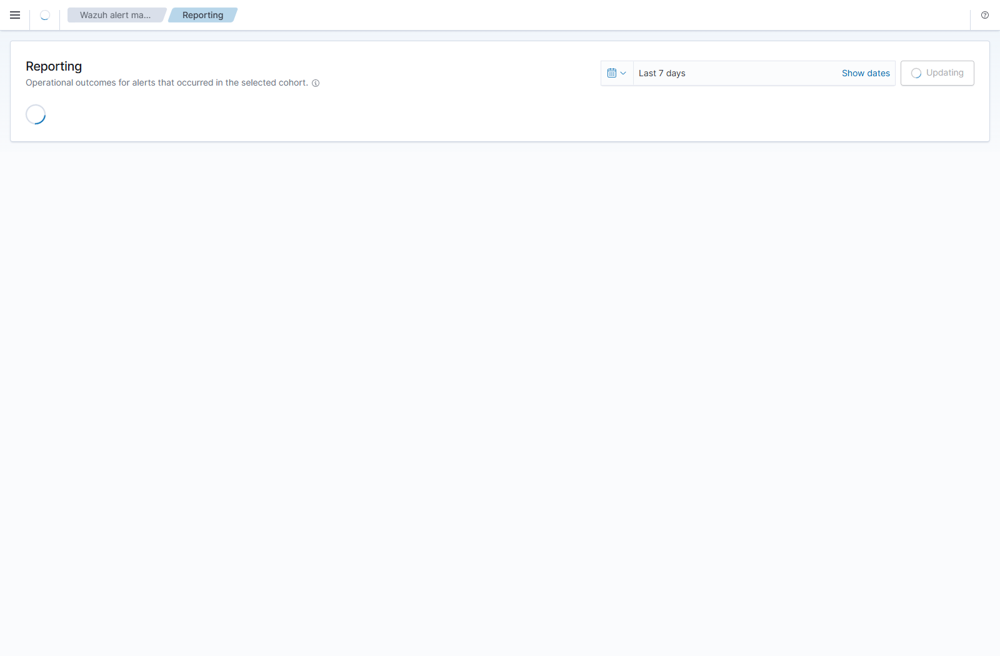

# Reporting

The **Reporting** app (second entry in the nav group) summarises alert and case activity over a time range you choose with the date picker. It has an **Overview** tab plus per-analyst tabs.

## Overview

- **KPI tiles** — Total alerts, Open / In progress / Closed, Mean time to assign, Mean time to resolve, and SLA compliance. Time-based tiles carry an info tooltip explaining exactly how they're measured.
- **Period-over-period deltas** — each KPI shows a **▲/▼ %** vs the immediately preceding equal-length window. Colour encodes *better/worse*, not just direction (a rising resolve time is red; a rising SLA % is green). Hover for the prior value.
- **Alert volume per day** — an area trend.
- **Current disposition by occurrence date** — a **stacked** daily chart showing the current status of alerts that occurred on each date. It is not historical status as of that date.
- **Alerts by status** and **Cases by severity** — donut charts with a count-legend (dot · label · count · %) and a centre total.
- **SLA breakdown by severity** — resolved / within-SLA / breached / compliance %, against the severity-based targets.
- **Cases** — created count, status split, and mean time to close.

### Accuracy notes

- **All operational figures are exact for the live, unarchived cohort** — total alerts, status breakdown, MTTA, MTTR, SLA, per-analyst resolution, and leaderboard. There is no sampling.
- **Timing and SLA come from bounded write-time fields** materialized when an alert is assigned or closed (`reporting.*` on the alert projection). Alert and case totals, timing, status, and severity are exact OpenSearch aggregations; per-analyst buckets use complete composite pagination instead of a top-N or document sample. A resumable background backfill materializes alert timing fields for records that predate the release; until it completes, the Overview shows a "backfill pending" notice rather than a silent sample.
- Reports query live, unarchived alert and case aliases. Archived alerts and cases are excluded. Restoring alerts can therefore change totals and timing or SLA results for historical time ranges.
- Timing depends on live activity history. If activity has been retired or the write-time fields are pending backfill, timing and SLA results can be incomplete and the UI marks it explicitly.
- Reports are current operational views, not immutable compliance records. Export or preserve evidence separately when a fixed audit record is required.

## SLA targets

| Severity | Wazuh level | Target |
|----------|-------------|--------|
| Critical | 12+ | 1 hour |
| High | 7–11 | 4 hours |
| Medium | 4–6 | 24 hours |
| Low | 0–3 | 3 days |

SLA compliance is the share of *resolved* alerts closed within their severity's target, subject to the live-data and activity-history scope above.

## Per-analyst tabs

- **Workload** — open / in-progress / closed / total per assignee (complete cardinality via composite aggregation).
- **Performance** — resolved count and mean time to resolve per assignee (exact, from write-time fields).
- **Cases by analyst** — case status split and mean time to close per owner (includes an In-progress column).
- **Leaderboard** — analysts ranked by resolved throughput (exact).
