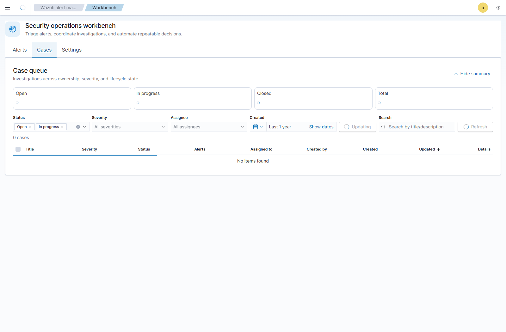

# User Guide

The plugin adds a collapsible **Wazuh alert manager** group to the left navigation with two apps:

- **Workbench** — day-to-day triage: **Alerts**, **Cases**, **Settings**.
- **Reporting** — metrics and analyst breakdowns (see [[Reporting]]).

The plugin title appears in the breadcrumb bar, matching the Wazuh modules.

---

## Alerts

The Alerts tab is a filterable table of Wazuh alerts with workflow state layered on top.

### Status lifecycle

Every alert has a status: **Open → In progress → Closed**. Status is stored by the plugin, separate from the raw Wazuh alert, so re-syncing never overwrites an analyst's decision.

> The default view shows **Open + In progress** so closed noise stays out of the way.

### Filters

A single-row filter bar: status toggles, severity/level, rule, agent, alert type, assignee, a time range, and a full-width **Lucene query** box for advanced expressions (e.g. `rule.description:*ssh* AND NOT agent.name:server1`).

### Row actions & bulk actions

- Click a row to open the **detail flyout**. Clicking the checkbox or a control does **not** open the flyout.
- Select multiple rows to **change status**, **add to a case**, or **open a case** in bulk.

### The alert flyout

- **Overview** — a **"seen before"** precedent callout (how the same rule has been handled on the same host), key fields, and inline **status** (segmented control) / **assignee** / **case** controls. Expand to full-screen with the header button.
- **Comments** — a threaded discussion on the alert.
- **Related Alerts** — alerts you've explicitly linked, plus a **Suggested** section that ranks alerts sharing a host, source IP, user, or rule within ±24h, each with a one-click **Link**.
- **AI Analysis** — optional, see [[AI Analysis]].
- **History** — the full audit trail.
- **Detailed Data / Raw JSON** — the complete alert document.

---

## Cases

A **case** groups related alerts into a single investigation.

### Queue filters

Status, Severity, Assignee, Created time, and title/description search are
combined with **AND**. Status, Severity, and Assignee are multi-select controls.
Choosing `High + Critical` means either severity; choosing `admin + Unassigned`
means either ownership state. Summary cards use the same filters except Status,
so they continue to show the filtered Open/In-progress/Closed distribution.

- **Fields** — title, description, **severity** (Low / Medium / High / Critical), **status** (Open / In progress / Closed), assignee, and linked alerts.
- **Default view** shows Open + In progress.
- **Comments** — threaded, like alerts.
- **Attack path** — a dependency-free entity graph of the case's alerts across **hosts / accounts / techniques**, with co-occurrence links and pan/zoom, plus a MITRE **kill-chain** table (tactic → techniques, first/last seen). Nodes are labelled by entity with an "N alerts" caption (one host in 102 alerts reads as *one host*, not 102).

Cases can be created manually from selected alerts, or automatically by [[Automation Rules]].

---

## Settings

Settings include:

- **Automation rules** — create, preview, revision, activate, pause, and diagnose
  ingestion-time rules. Queue and automation dead-letter controls are restricted
  to Wazuh administrators. See [[Automation Rules]].
- **AI analysis** — configure an optional LLM provider. API keys remain
  server-side and require the configured encryption key. See [[AI Analysis]].
- **Background sync** — view the native-alert read pattern, sync watermark,
  overlap, interval, batch size, and sync-DLQ health. Changes apply to the plugin
  projection only; `wazuh-alerts-*` remains read-only.
- **Storage & lifecycle** — configure generation rollover and retention, inspect
  every plugin-owned alias family, and perform reviewed retire/restore/purge
  operations. Mutating controls require the effective Wazuh lifecycle role. See
  [[Lifecycle Retention and RBAC]] and [[Case Evidence and Case Lifecycle]].
- **About** — compare the browser and server build IDs. `Current` means both
  bundles came from the same installed release; a mismatch prompts a reload.

## Reporting

Reporting is a separate navigation child rather than a Workbench tab. All
figures are exact over the selected live, unarchived cohort; no document sample
is used. See [[Reporting]] for cohort semantics, SLA targets, archive effects,
backfill coverage, and analyst tabs.
